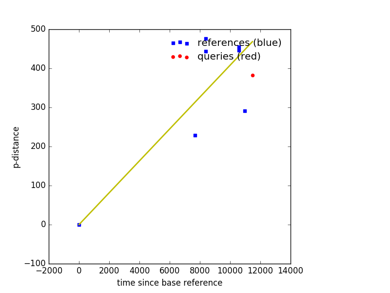

plot_muts
=========

Plot mutations either by comparing two sequences or by comparing a bunch of sequences
to another sequence.

Usage
-----

You can view the usage of degen_regions via::

    plot_muts --help
    
Example comparing multiple sequences against a query sequence
-------------------------------------------------------------

``--refs`` is a fasta file containing multiple sequences where the sequence that has
the earliest date will be used as the base reference.

``--query`` is a fasta file containing a single sequence to be plotted in a different
color to see how it compares.

.. code-block:: bash

    plot_muts --refs tests/testinput/refs.fas --query tests/testinput/query.fas --out plot.png

The ``--out`` option is optional. If it is not provided, the plot will pop up on 
the user's screen automatically. If this does not work, try saving the image using ``--out`` instead.

Example Output
++++++++++++++

Plot muts also outputs a csv file named after the ``--out`` with .csv appended

.. code-block:: text

    name,dates,p-dist
    Ref_gi|499073378|gb|KC807176.1|_Houston_virus_strain_V3982_complete_genome____2004,8401,476
    Ref_gi|499073386|gb|KC807178.1|_Houston_virus_strain_16757_complete_genome____2010,10592,455
    Ref_gi|499073382|gb|KC807177.1|_Houston_virus_strain_16740_complete_genome____2010,10592,446
    Ref_gi|499073374|gb|KC807175.1|_Houston_virus_strain_V3872_complete_genome____2004,8401,444
    Query_A12x2520____08_16_2012,11478,383
    Ref_gi|557884407|gb|KF522691.1|_Nam_Dinh_virus_isolate_SZ11706Z_complete_genome____2011,10957,291
    Ref_gi|341819796|gb|DQ458789.2|_Nam_Dinh_virus_isolate_02VN178_complete_genome____2002,7670,229
    BaseRef_gi|499073354|gb|KC807170.1|_Ngewotan_virus_strain_JKT9982_complete_genome____1981,0,0

Input File Requirements
-----------------------

The input must be fasta format. Both the query and ref files can have any number of sequences.

The year should be the last part of the ID, preceded by a quadruple underscore. e.g.::

    >some|info|blah_blah____2001_09_2010
    >some____1995
    >some____09/09/2012
    
If the ID uses '/' rather than underscore, plot_muts currently accepts the year 
as the *fourth* field. e.g.::

    >some/info/blah/1995
    >some/info/blah/1995/more/info
